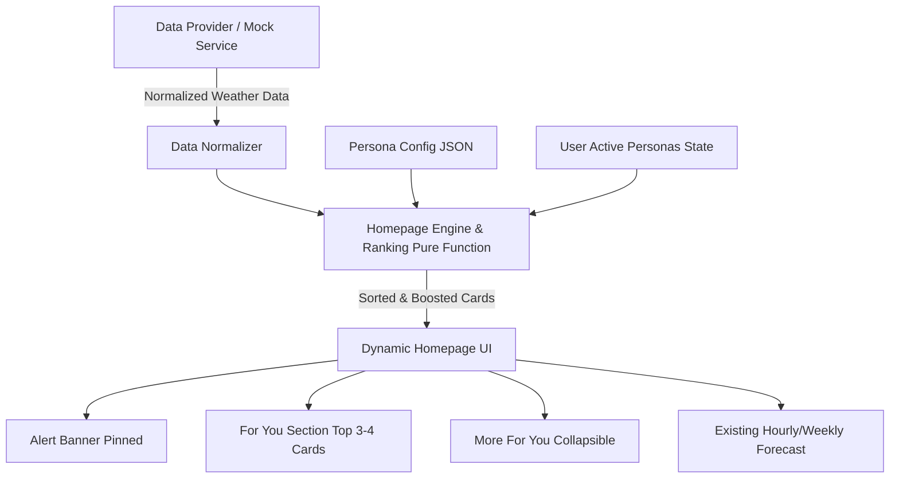

# Mausam Architecture & Design

## 1. System Overview

The Personalized Homepage architecture decouples data acquisition, persona-based scoring, and card presentation.



---

## 2. Ranking Engine Formula

The card ranking score is calculated using pure functions:

$$\text{score} = \text{personaWeight} + \text{dangerBoost} + \text{timeBoost}$$

### Score Components
1. **`personaWeight`**: Base weight assigned to a card for the user's selected active personas (e.g. Health persona gives +30 to AQI Card).
2. **`dangerBoost`**: Added **+50** if weather parameters cross danger thresholds:
   - AQI > 150 (Poor/Severe)
   - UV Index >= 8 (Very High/Extreme)
   - Temperature > 40°C or Heat Index High
   - Rain Probability > 70% or Severe Weather Warning
3. **`timeBoost`**: Added **+20** if relevant to current time window:
   - Outdoor Running Card: 05:00 - 07:00 / 18:00 - 20:00
   - School / Work Commute Card: 07:00 - 10:00 / 17:00 - 20:00
   - Beach Card: 06:00 - 10:00

---

## 3. Data Flow & Component Architecture

```
App Top Level
│
├── Personas Provider (localStorage sync)
├── Weather Provider (Mock Data / IMD API)
└── Homepage View (Mobile Frame 390px)
    ├── Header (Location, Date, Current Temp, High/Low)
    ├── Alert Banner (If Red/Orange warning exists)
    ├── Persona Chip Bar (Live filter & toggle)
    ├── "For You" Section (Top 3-4 ranked cards)
    ├── "More for you" Section (Collapsible lower-tier cards)
    └── Forecast Section (Hourly & 7-day temperature bars)
```
